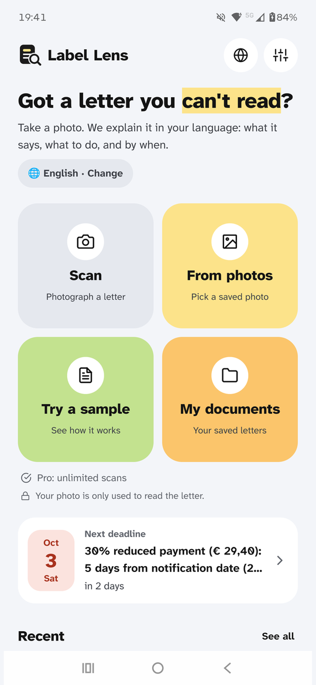
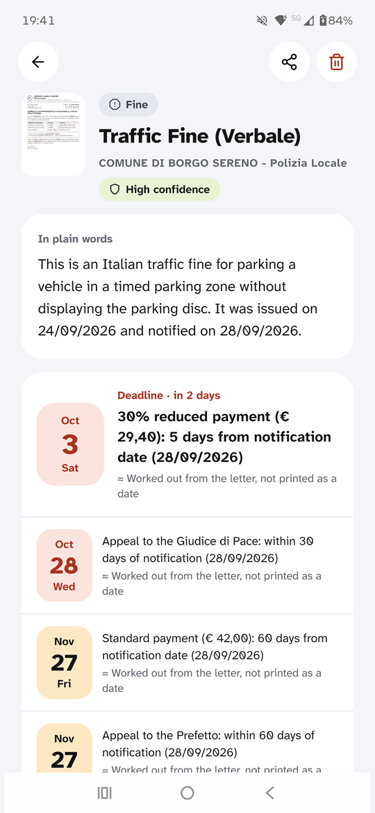
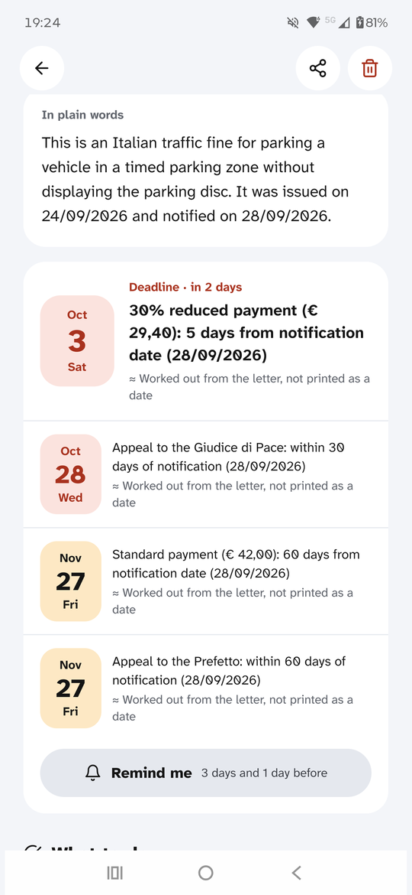
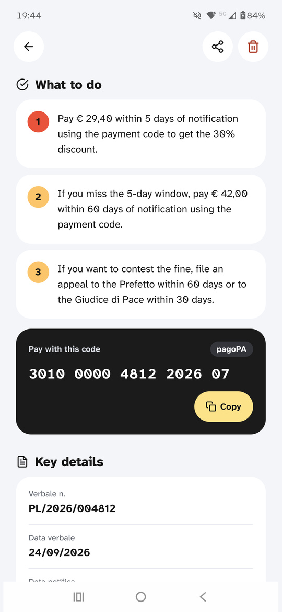
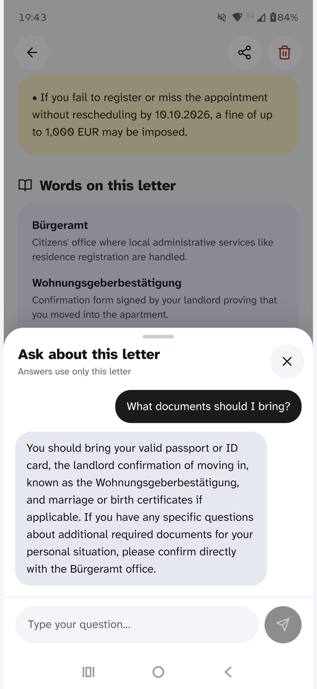
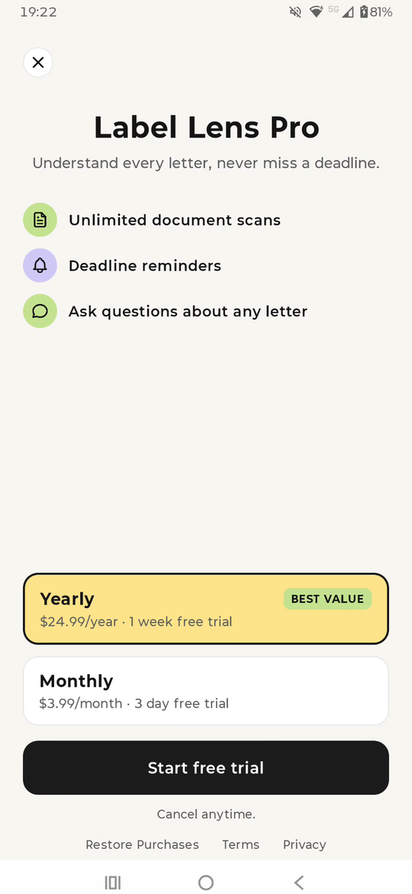

# Label Lens 🔎

**Understand any letter, form or label — in your language.**

Newcomers, immigrants and refugees get official letters they can't read: tax notices, fines, residence-permit appointments, school letters, medicine boxes. Missing a deadline can mean penalties or losing a permit. Label Lens turns a photo of any document into:

- a **plain-language summary** in 12 languages (incl. Persian, Arabic, Ukrainian, Urdu, Bengali — right-to-left support for Persian, Arabic and Urdu)
- **deadlines** pulled from the document, with reminder notifications
- **step-by-step "what to do"** (where to go, what to bring, how to pay)
- **warnings** (penalties, scam red flags) and a **glossary** of the bureaucratic terms
- a **follow-up chat** about that specific document

Built for the RevenueCat Shipaton 2026 — Next Gen Award.

## Screenshots

| Home | Explained in your language | Deadlines |
|:---:|:---:|:---:|
|  |  |  |

| What to do and how to pay | Ask about the letter | Label Lens Pro |
|:---:|:---:|:---:|
|  |  |  |

The letters in these screenshots are fictional test documents.

## Privacy by design
- Our proxy stores nothing. The photo is sent to Google Gemini only to read it; Label Lens doesn't keep it on any server.
- History lives only in local storage; delete any scan at any time.
- The model is instructed never to invent amounts or dates — unreadable parts are listed explicitly and confidence is shown.

## Monetization (RevenueCat)
| Free | Pro (`pro` entitlement) |
|---|---|
| 3 scans / week | Unlimited scans |
| Full explanation | + Follow-up chat per document |
| Local history | + Deadline reminders |

Monthly and annual subscriptions (**$24.99/year or $3.99/month**) with a **free trial (1 week on yearly, 3 days on monthly)**, sold through a RevenueCat Paywall (`react-native-purchases-ui`), plus Customer Center for managing/restoring. Every scan has a real model cost, so usage-based gating keeps the free tier sustainable while the people who need it most can still use it.

## Architecture
```
Expo app (React Native, TS)
  ├─ expo-image-picker → resize to 1600px JPEG (expo-image-manipulator)
  ├─ POST /analyze  ─┐
  ├─ POST /ask      ─┤→ Cloudflare Worker (worker/) → Gemini (JSON schema output)
  ├─ react-native-purchases + RevenueCat Paywall
  └─ expo-notifications (deadline reminders), AsyncStorage (history)
```
The Gemini API key only lives in the Worker as a secret.

## Run it

```bash
git clone https://github.com/MohsenMaaleki/label-lens.git
cd label-lens
```

### 1. Worker
```bash
cd worker
npm install
npx wrangler login
npx wrangler secret put GEMINI_API_KEY   # from aistudio.google.com
npx wrangler secret put APP_TOKEN        # any random string
npm run deploy                           # prints your *.workers.dev URL
```
Local dev: copy `.dev.vars.example` → `.dev.vars`, then `npm run dev`.

### 2. RevenueCat
1. Create a project + Android (and/or iOS) app in RevenueCat.
2. Products: `labellens_pro_annual_trial` ($24.99/year, 1-week free trial) and `labellens_pro_monthly_trial` ($3.99/month, 3-day free trial) → attach to entitlement **`pro`** → put them in the **default offering**.
3. Design a Paywall for that offering in the dashboard.
4. Copy the public SDK keys into `.env`.

For development without store products, use RevenueCat's **Test Store** API key (it only works in a debuggable build).

### 3. App
```bash
npm install
cp .env.example .env    # fill in values
npx expo run:android    # or: npx eas-cli build --profile development
```
RevenueCat needs native code, so use a development build (not Expo Go).

## Disclaimer
Label Lens helps you understand documents. It is not legal, medical or financial advice.

## License
MIT
